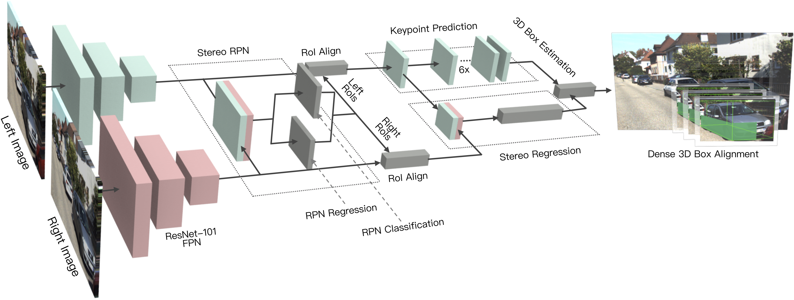
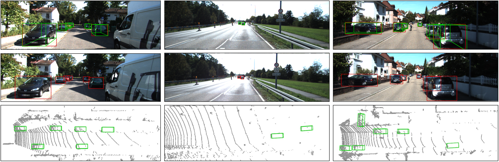

# Stereo R-CNN
## Stereo R-CNN based 3D Object Detection for Autonomous Driving




This project contains the implementation of our CVPR 2019 paper [arxiv](https://arxiv.org/pdf/1902.09738.pdf).

Stereo R-CNN focuses on accurate 3D object detection and estimation using image-only data in autonomous driving scenarios. It features simultaneous object detection and association for stereo images, 3D box estimation using 2D information, accurate dense alignment for 3D box refinement. We also provide a light-weight version based on the monocular 2D detection, which only uses stereo images in the dense alignment module. Please checkout to branch [mono](https://github.com/HKUST-Aerial-Robotics/Stereo-RCNN/tree/mono) for details.

**Authors:** [Peiliang Li](https://peiliangli.github.io/), [Xiaozhi Chen](https://xiaozhichen.github.io/) and [Shaojie Shen](http://uav.ust.hk/group/) from the [HKUST Aerial Robotics Group](http://uav.ust.hk/), and [DJI](https://www.dji.com/).

If you find the project useful for your research, please cite: 

```
@inproceedings{licvpr2019, 
    title     = {Stereo R-CNN based 3D Object Detection for Autonomous Driving}, 
    author    = {Li, Peiliang and Chen, Xiaozhi and Shen, Shaojie}, 
    booktitle = {CVPR}, 
    year      = {2019} 
}
```

## 0. Install

This implementation is tested under Pytorch 1.0.0. To avoid affecting your Pytorch version, we recommend using conda to enable multiple versions of Pytorch.

0.0. Install Pytorch:
```
    conda create -n env_stereo python=3.6
    conda activate env_stereo
    conda install pytorch=1.0.0 cuda90 -c pytorch
    conda install torchvision -c pytorch
```
0.1. Other dependencies:
```
    git clone git@github.com:HKUST-Aerial-Robotics/Stereo-RCNN.git
    cd stereo_rcnn
    git checkout 1.0
    pip install -r requirements.txt
```
0.2. Build:
```
    cd lib
    python setup.py build develop
    cd ..
```


## 1. Quick Demo

1.0. Set the folder for placing the model
```
    mkdir models_stereo
```
1.1. Download our trained weight [One Drive](https://hkustconnect-my.sharepoint.com/:u:/g/personal/pliap_connect_ust_hk/ETowGlAcACJBman4TnBO5LMB2-9NQPf1h_8Cd9Xl0HUIkQ?e=QmXwJC)/[Google Drive](https://drive.google.com/file/d/1rIS43NzTvjRMX9m3UZIG5EvgFzXOVZWX/view?usp=sharing) and put it into models_stereo/, then just run

```
    python demo.py
```

If everything goes well, you will see the detection result on the left, right and bird's eye view image respectively.

## 2. Dataset Preparation

2.0. Download the left image, right image, calibration, labels and point clouds (optional for visualization) from [KITTI Object Benchmark](http://www.cvlibs.net/datasets/kitti/eval_object.php?obj_benchmark=3d). Make sure the structure looks like:
```
yourfolder/object
              training
                image_2
                image_3
                label_2
                calib
                velodyne
```
2.1. Create symlinks:
```
    cd data/kitti
    ln -s yourfolder/object object
    cd ../..
```
## 3. Training

Download the Res-101 pretrained weight [One Drive](https://hkustconnect-my.sharepoint.com/:u:/g/personal/pliap_connect_ust_hk/ESxYZL8TjzxAneYh_mWflFsBs0lZ-hc4m67W1k9_hYgXzQ?e=dZdoej)/[Google Drive](https://drive.google.com/file/d/1_t8TtUevtMdnvZ2SoD7Ut8sS1adyCKTt/view?usp=sharing), and put it into data/pretrained_model

Set corresponding CUDA_VISIBLE_DEVICES in train.sh, and simply run
```
    ./train.sh
```
It consumes ~11G GPU memery for training. If your GPU memery is not enough, please try our light-weight version in branch mono.

The trained model and training log are saved in /models_stereo by default.

## 4. Evaluation

You can evaluate the 3D detection performance using either our provided model or your trained model. 
Set corresponding CUDA_VISIBLE_DEVICES in test.sh, and run
```
    ./test.sh
```

The results are saved in models_stereo/result/data by default. You can evaluate the results using the tool from [here](https://github.com/prclibo/kitti_eval).

Some sample results:



## 5. Acknowledgments

This repo is built based on the Faster RCNN implementation from [faster-rcnn.pytorch](https://github.com/jwyang/faster-rcnn.pytorch) and [fpn.pytorch](https://github.com/jwyang/fpn.pytorch), and we also use the imagenet pretrained weight (originally provided from [here](https://filebox.ece.vt.edu/~jw2yang/faster-rcnn/pretrained-base-models/resnet101_caffe.pth)) for initialization.

## 6. License
The source code is released under [MIT](https://opensource.org/licenses/MIT) license.

We are still working on improving the code reliability. For any technical issues, please contact Peiliang Li <pliapATconnect.ust.hk>.

For commercial inquiries, please contact Shaojie Shen <eeshaojieATust.hk>.
